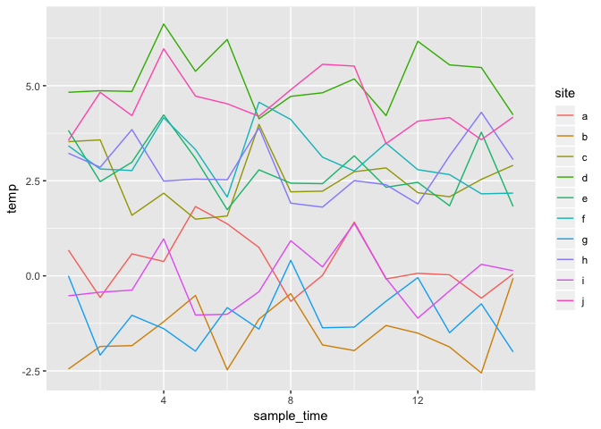
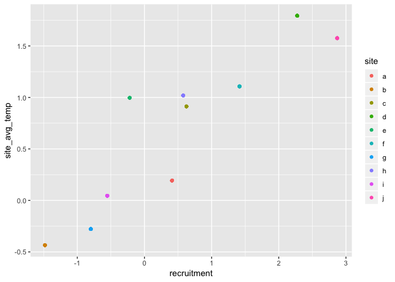
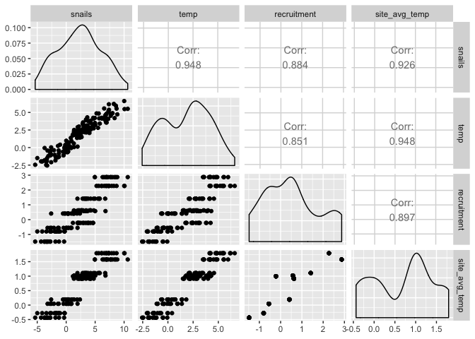

Note: the following is a work in progress. Feel free to tweet me @jebyrnes or email me at jarrett.byrnes@umb.edu to discuss it more!

## Causal Inference from Different Model Structures

The world is a complex place. Often, when we have hierarchical data - particularly data where we have repeated observations of the same locations over time - deducing causal inference with confidence is a tricky business. While a default for estimation might be to throw in all of the predictors you're interested in, and then slosh everything else into a site-level random effect, that doesn't guaruntee proper causal inference. I'm going to discuss some reasons why drawing heavily on some principles as outlines by the recent Bell et al. 2017 paper which discussed the core nugget of the literature as well as some great review by notes from [Marc Bellmare's course notes on causal inference from observational data](https://twitter.com/marcfbellemare/status/1008710931377946624). Along the way I'll talk a bit about shutting the back door (*sensu* Pearl) and how random effects relate to causal model structures and the back door problem.

Let's start with a biological scenario. Let's say that we have a system we're looking at where we thing that snail abundance might be influenced by temperature. We sample the same sites for 15 years, and want to build a model where we look at whether temperature influences snail abundance as sampled by a site.

There are just two catches.

First, as I simulate this data, yes, snail abundance is influenced by temperature. However, the sites each have a different average temperature. This is something many of us who sample along biogeographic gradients are familiar with. Second, recruitment of new snails correlates with site average temperature. So, perhaps, sites that experience warmer temperatures on average also have higher recruitment due to site characteristics. There’s also some residual uncorrelated site effects unrelated to temperature or recruitment. 

<!--html_preserve--><div id="htmlwidget-65d696958b075e3fbfc2" style="width:672px;height:480px;" class="grViz html-widget"></div>
<script type="application/json" data-for="htmlwidget-65d696958b075e3fbfc2">{"x":{"diagram":"\n digraph{\n\n  graph [layout = \"circo\", fontsize=6, overlap=\"false\"]\n\n  node [shape = box,\n        fontname = Helvetica]\n  \"Site Average\nTemperature\", \"Dev. from\nSite Avg.\", \n  Recruitment, Snails, Temperature, Site\n\n  \"Site Average\nTemperature\" -> Temperature\n  \"Dev. from\nSite Avg.\" -> Temperature\n  \"Site\" -> Recruitment\n  \"Site\" -> \"Site Average\nTemperature\"\n  \"Site\" -> Snails\n  Recruitment -> Snails\n  Temperature -> Snails\n\n\n } \n","config":{"engine":"dot","options":null}},"evals":[],"jsHooks":[]}</script><!--/html_preserve-->

For fellow nerds keeping track, I made that and other figures with http://rich-iannone.github.io/DiagrammeR/

Or, here's the simulation of the data itself. This is one way to do it, there are others.


```r
set.seed(nchar("A causal model  odyssey"))

#the basic physical data
my_df <- crossing(tibble(site = letters[1:10], 
                  site_avg_temp = rnorm(10),
                  recruitment = rnorm(10, site_avg_temp)),
                  deviation_from_site_avg = rnorm(15)) %>%
  mutate(temp = 3*site_avg_temp + deviation_from_site_avg) %>%
  arrange(ord = rnorm(150)) %>% #randomness!
  group_by(site) %>%
  mutate(sample_time = 1:15) %>%
  ungroup()
```

Let's see how temperature varies over time.


```r
qplot(sample_time, temp, data = my_df, color = site, geom="line")
```

<!-- -->

OK, now we'll add recruitment which correlates with site-level temperature.


```r
#A site-level covariate that correlated with site average temperature
#my_df <- my_df %>%
#  mutate(recruitment = rnorm(n(), site_avg_temp))
```

What does that correlation look like?


```r
qplot(recruitment, site_avg_temp, data = my_df, color = site, geom="point")
```

<!-- -->

Finally, snails are a sum of temperature and recruitment.


```r
#OK, snail abund is a function of temperature and recruitment
my_df <- my_df %>%
  mutate(snails = rnorm(n(), temp + recruitment))
```


## The Problem

This is all well and good, and if we had measurements of everything above, we could do wonders. But we don't. All we have is temperature at each site i at each point in time j and snail abundance. And, in fact, while I've outlined recruitment as a site-level variabilty that would affect temperature, who knows what elses is there that correlated with temperature! The best we can do is something that has this sort of structure

<!--html_preserve--><div id="htmlwidget-ff0a928df43db3b5369f" style="width:672px;height:480px;" class="grViz html-widget"></div>
<script type="application/json" data-for="htmlwidget-ff0a928df43db3b5369f">{"x":{"diagram":"\n digraph{\n\n  graph [layout = \"circo\", fontsize=6, overlap=\"false\"]\n\n  node [shape = plaintext,\n        fontname = Helvetica]\n  Site, Snails, Temperature\n\n  \"Site\" -> Snails\n  Temperature -> Snails\n\n\n } \n","config":{"engine":"dot","options":null}},"evals":[],"jsHooks":[]}</script><!--/html_preserve-->

This despite the underlying relationships in our nature (where we know all of the data) looking like


```r
ggpairs(my_df %>% select(snails, temp, recruitment, site_avg_temp))
```

<!-- -->

OK, so, how do we craft our model so that we can get a **causally** valid estimate of temperature on snails? One that accomodates the fact that temperature at the site level could correlate with other site-level covariates and makes sure that site-level covariates are not contaminating our estimate of the temperature effect due to non-independence between error estimates in the model and our estimates of the temperature effect?

There are a few options. Let's start with what is a common first approach.

(see also https://t.co/0uINKPb7EA)

## The Models

### Random Intercept Model

In a random effects model, we're evaluating a model where temperature is presumed to influence snails, and the residual error is partitioned between site-level error (sites) such that samples within a site covary (all depart from the grand mean in the same direction) and residual error. If we say that random effects are those with circles around them, the model looks like so. I'll include error in this figure to make things explicit, but will leave it out in future figures.

<!--html_preserve--><div id="htmlwidget-d416c0ca4c9ff4b79316" style="width:672px;height:480px;" class="grViz html-widget"></div>
<script type="application/json" data-for="htmlwidget-d416c0ca4c9ff4b79316">{"x":{"diagram":"\n digraph{\n\n  graph [layout = \"dot\", fontsize=6, overlap=\"false\"]\n\n  node [shape = box,\n        fontname = Helvetica]\n  Snails, Temperature\n\n  subgraph cluster0 {\n\t\tcolor = \"lightgrey\"\n    style = \"filled\"\n    shape = \"oval\"\n\n    node  [shape = oval,\n          fontname = Helvetica]\n\n    edge[style=invis]\n    Site -> Error\n}\n  Site -> Snails\n  Error -> Snails\n  Temperature -> Snails\n\n\n } \n","config":{"engine":"dot","options":null}},"evals":[],"jsHooks":[]}</script><!--/html_preserve-->

There's a problem here. And that's that when we estimate random effects, we're doing so with the residual after accounting for the fixed effects. We're estimating the correlation in error terms due to being clustered into sites. But - that means we aren't controlling for things happening at the site level when we estimate that site level random effect. In essence, the model has an implied correlation between temperature and site, and because of that the estimates of the temperature effect are contaminated by other processes occuring at the site level. 

So, some of that recruitment signal - if not all of it - is going into your coefficient estimate for temperature.

For an even better explanation that I've written see Bell et al. 2017 and https://stats.stackexchange.com/questions/66161/why-do-random-effect-models-require-the-effects-to-be-uncorrelated-with-the-inpu

### Fixed Effects Model
Well that was alarming.  What to do? In econometrics, a classical solution has been to model Site as a fixed effect. I know, I know, in Ecology and the like we've been taught that Fixed effects are for when we have all of the relevant group levels or somesuch. I.e., they are non-varying coefficients not drawn from some distribution, but rather we have the full set of what we need to know about a particular set of possible conditions. This is a different take than (so I understand) econometrics, where they're really jsut interested in relaxing the random effects assumption of including a SD that each group draws from. Indeed, REs are typically more confined to experiments. 

For purposes of estimation of a temperature effect, particularly if we don't really care about that site effect, modeling them as a fixed effect lets us accout for temperature while controlling for site - i.e., we try and control for that site level signal. It's more efficient, and we don't run into the trap of having some of that site-effect due to other covariates slosh into our estimate of the temperature effect.

<!--html_preserve--><div id="htmlwidget-15e8188c3daa5cd098e1" style="width:672px;height:480px;" class="grViz html-widget"></div>
<script type="application/json" data-for="htmlwidget-15e8188c3daa5cd098e1">{"x":{"diagram":"\n digraph{\n\n  graph [layout = \"dot\", fontsize=6, overlap=\"false\"]\n\n  node [shape = box,\n        fontname = Helvetica]\n  Snails, Temperature, Site\n\n  Site -> Snails\n  Site -> Temperature [dir=\"both\"]\n  Temperature -> Snails\n\n\n } \n","config":{"engine":"dot","options":null}},"evals":[],"jsHooks":[]}</script><!--/html_preserve-->

Site now is a number of dummy variables (1/0) for site, and we're controlling for them while we estimate the temperature effect.

### Mundlak Device

But...but... one might still be worried about some of that recruitment effect sloshing into temperature, depending on the data. And site should be random! At least, that's what some of you might be saying as you try and nail the model structure. That's OK - there's a model that should recover the proper estimate while controlling for site-level temperature and/or anything correlated with it.

If we want to remove anything that is correlated with the site component of temperature, and include a random site component, then why not include a hierarcical predictor along with one's random effect. This has the effect of taking the recruitment signal, for example, out of the picture, and we can get a cleaner estimate of the true temperature effect. We do this with a hierarchical site average temperature term.

<!--html_preserve--><div id="htmlwidget-61ca6d0a93a90def28ab" style="width:672px;height:480px;" class="grViz html-widget"></div>
<script type="application/json" data-for="htmlwidget-61ca6d0a93a90def28ab">{"x":{"diagram":"\n digraph{\n\n  graph [layout = \"dot\", fontsize=6, overlap=\"false\"]\n\n  node [shape = box,\n        fontname = Helvetica]\n  Snails, Temperature, \"Site Average\nTemperature\"\n\n  node  [shape = oval,\n          fontname = Helvetica]\n  Site\n\n  Site -> Snails\n  Temperature -> Snails\n  \"Site Average\nTemperature\" -> Snails\n  \"Site Average\nTemperature\" -> Temperature  [dir=\"both\"]\n\n } \n","config":{"engine":"dot","options":null}},"evals":[],"jsHooks":[]}</script><!--/html_preserve-->

Because we're estimating both fixed effects, we estimate the temperature effect while controlling for site average temperature - which correlates with recruitment. Hence we get a clean estimate. We've also pulled off the variation due to anything correlated with site averge temperature, and hence can feel good about our RE specification for site again.

### Group Mean Centered Model

I still admit, the previous model is still a tad odd to me, as we have site average temperature and temperature (which include site average). I understand why we're getting a good estimate, but, I prefer a different representation. And one that gives a cleaner separation of spatial and temporal drivers. To do so, we can group mean center site temperature. In other words, for temperature at site i and time j, $Tc_{ij} = T_{ij} - \bar{T_i}$.

<!--html_preserve--><div id="htmlwidget-7bbbe9f799a0af8c0346" style="width:672px;height:480px;" class="grViz html-widget"></div>
<script type="application/json" data-for="htmlwidget-7bbbe9f799a0af8c0346">{"x":{"diagram":"\n digraph{\n\n  graph [layout = \"dot\", fontsize=6, overlap=\"false\"]\n\n  node [shape = box,\n        fontname = Helvetica]\n  Snails, \"Site Average\nTemperature\", \"Dev. from\nSite Avg.\"\n\n  node  [shape = oval,\n          fontname = Helvetica]\n  Site\n\n  Site -> Snails\n  \"Dev. from\nSite Avg.\" -> Snails\n  \"Site Average\nTemperature\" -> Snails\n  \"Site Average\nTemperature\" -> \"Dev. from\nSite Avg.\"  [dir=\"both\", label=\"0\"]\n\n } \n","config":{"engine":"dot","options":null}},"evals":[],"jsHooks":[]}</script><!--/html_preserve-->

In this model, site average temperature takes on the recruitment and site-level temperature effect. But now that we get this group mean centered term, we are better able to assess whether there is a real temperature signal, uncontaminated by other site-level covariates.

### Difference Model

So, as long as we think the problem really is all of these site-varying covariates that correlate, one way to remove the site-varying problem is to, instead of looking at the raw data, difference it. So, we now look at change in temperature and change in snails. By differencing, we remove any site-level effects, although there could still be some variability site to site in snail trends.  


```r
my_df <- my_df %>%
  group_by(site) %>%
  arrange(sample_time) %>%
  mutate(delta_temp = temp - lag(temp),
         delta_snails = snails - lag(snails)) %>%
  ungroup()
```

<!--html_preserve--><div id="htmlwidget-00eb7784e70643115645" style="width:672px;height:480px;" class="grViz html-widget"></div>
<script type="application/json" data-for="htmlwidget-00eb7784e70643115645">{"x":{"diagram":"\n digraph{\n\n  graph [layout = \"dot\", fontsize=6, overlap=\"false\"]\n\n  node [shape = box,\n        fontname = Helvetica]\n  \"Change in\nSnails\", \"Change in\nTemperature\"\n\n  node  [shape = oval,\n          fontname = Helvetica]\n  Site\n\n  Site -> \"Change in\nSnails\"\n  \"Change in\nTemperature\" -> \"Change in\nSnails\"\n\n } \n","config":{"engine":"dot","options":null}},"evals":[],"jsHooks":[]}</script><!--/html_preserve-->

## Comparisons Between Approaches

### Comparing Models
Let's take all of these out for a spin and see how they compare. First, here are all of the models. Note, I'm using `nlme`, but, whateves. Use what you like!


```r
library(nlme)
```

```
## 
## Attaching package: 'nlme'
```

```
## The following object is masked from 'package:dplyr':
## 
##     collapse
```

```r
#Now, on to models
ran_mod <- lme(snails ~ temp,
               random = ~1|site,
               data= my_df)

fix_mod <- lm(snails ~ temp + site, data = my_df)
 
mundlak_mod <- lme(snails ~ temp + site_avg_temp,
                    random = ~1|site,
                    data= my_df)
 
gmc_mod <- lme(snails ~ deviation_from_site_avg + site_avg_temp,
                random = ~1|site,
                data= my_df) 

diff_mod <- lme(delta_snails ~ delta_temp,
                random = ~1|site,
                data = my_df,
                na.action = na.omit)
```

Now, let's compare them:


```r
ran_mod %>% broom::tidy(effects="fixed") %>% kable("html",3) %>% kable_styling
```

<table class="table" style="margin-left: auto; margin-right: auto;">
 <thead>
  <tr>
   <th style="text-align:left;"> term </th>
   <th style="text-align:right;"> estimate </th>
   <th style="text-align:right;"> std.error </th>
   <th style="text-align:right;"> statistic </th>
   <th style="text-align:right;"> p.value </th>
  </tr>
 </thead>
<tbody>
  <tr>
   <td style="text-align:left;"> (Intercept) </td>
   <td style="text-align:right;"> -0.218 </td>
   <td style="text-align:right;"> 0.257 </td>
   <td style="text-align:right;"> -0.847 </td>
   <td style="text-align:right;"> 0.399 </td>
  </tr>
  <tr>
   <td style="text-align:left;"> temp </td>
   <td style="text-align:right;"> 1.360 </td>
   <td style="text-align:right;"> 0.076 </td>
   <td style="text-align:right;"> 17.942 </td>
   <td style="text-align:right;"> 0.000 </td>
  </tr>
</tbody>
</table>

```r
(fix_mod %>% broom::tidy())[1:2,]%>% kable("html",3) %>% kable_styling
```

<table class="table" style="margin-left: auto; margin-right: auto;">
 <thead>
  <tr>
   <th style="text-align:left;"> term </th>
   <th style="text-align:right;"> estimate </th>
   <th style="text-align:right;"> std.error </th>
   <th style="text-align:right;"> statistic </th>
   <th style="text-align:right;"> p.value </th>
  </tr>
 </thead>
<tbody>
  <tr>
   <td style="text-align:left;"> (Intercept) </td>
   <td style="text-align:right;"> 0.081 </td>
   <td style="text-align:right;"> 0.272 </td>
   <td style="text-align:right;"> 0.296 </td>
   <td style="text-align:right;"> 0.768 </td>
  </tr>
  <tr>
   <td style="text-align:left;"> temp </td>
   <td style="text-align:right;"> 1.097 </td>
   <td style="text-align:right;"> 0.116 </td>
   <td style="text-align:right;"> 9.415 </td>
   <td style="text-align:right;"> 0.000 </td>
  </tr>
</tbody>
</table>

```r
mundlak_mod %>% broom::tidy(effects="fixed")%>% kable("html",3) %>% kable_styling
```

<table class="table" style="margin-left: auto; margin-right: auto;">
 <thead>
  <tr>
   <th style="text-align:left;"> term </th>
   <th style="text-align:right;"> estimate </th>
   <th style="text-align:right;"> std.error </th>
   <th style="text-align:right;"> statistic </th>
   <th style="text-align:right;"> p.value </th>
  </tr>
 </thead>
<tbody>
  <tr>
   <td style="text-align:left;"> (Intercept) </td>
   <td style="text-align:right;"> -0.658 </td>
   <td style="text-align:right;"> 0.236 </td>
   <td style="text-align:right;"> -2.789 </td>
   <td style="text-align:right;"> 0.006 </td>
  </tr>
  <tr>
   <td style="text-align:left;"> temp </td>
   <td style="text-align:right;"> 1.097 </td>
   <td style="text-align:right;"> 0.116 </td>
   <td style="text-align:right;"> 9.415 </td>
   <td style="text-align:right;"> 0.000 </td>
  </tr>
  <tr>
   <td style="text-align:left;"> site_avg_temp </td>
   <td style="text-align:right;"> 1.338 </td>
   <td style="text-align:right;"> 0.420 </td>
   <td style="text-align:right;"> 3.184 </td>
   <td style="text-align:right;"> 0.013 </td>
  </tr>
</tbody>
</table>

```r
gmc_mod %>% broom::tidy(effects="fixed")%>% kable("html",3) %>% kable_styling
```

<table class="table" style="margin-left: auto; margin-right: auto;">
 <thead>
  <tr>
   <th style="text-align:left;"> term </th>
   <th style="text-align:right;"> estimate </th>
   <th style="text-align:right;"> std.error </th>
   <th style="text-align:right;"> statistic </th>
   <th style="text-align:right;"> p.value </th>
  </tr>
 </thead>
<tbody>
  <tr>
   <td style="text-align:left;"> (Intercept) </td>
   <td style="text-align:right;"> -0.658 </td>
   <td style="text-align:right;"> 0.236 </td>
   <td style="text-align:right;"> -2.789 </td>
   <td style="text-align:right;"> 0.006 </td>
  </tr>
  <tr>
   <td style="text-align:left;"> deviation_from_site_avg </td>
   <td style="text-align:right;"> 1.097 </td>
   <td style="text-align:right;"> 0.116 </td>
   <td style="text-align:right;"> 9.415 </td>
   <td style="text-align:right;"> 0.000 </td>
  </tr>
  <tr>
   <td style="text-align:left;"> site_avg_temp </td>
   <td style="text-align:right;"> 4.628 </td>
   <td style="text-align:right;"> 0.233 </td>
   <td style="text-align:right;"> 19.827 </td>
   <td style="text-align:right;"> 0.000 </td>
  </tr>
</tbody>
</table>

```r
diff_mod %>% broom::tidy(effects="fixed")%>% kable("html",3) %>% kable_styling
```

<table class="table" style="margin-left: auto; margin-right: auto;">
 <thead>
  <tr>
   <th style="text-align:left;"> term </th>
   <th style="text-align:right;"> estimate </th>
   <th style="text-align:right;"> std.error </th>
   <th style="text-align:right;"> statistic </th>
   <th style="text-align:right;"> p.value </th>
  </tr>
 </thead>
<tbody>
  <tr>
   <td style="text-align:left;"> (Intercept) </td>
   <td style="text-align:right;"> -0.037 </td>
   <td style="text-align:right;"> 0.126 </td>
   <td style="text-align:right;"> -0.291 </td>
   <td style="text-align:right;"> 0.772 </td>
  </tr>
  <tr>
   <td style="text-align:left;"> delta_temp </td>
   <td style="text-align:right;"> 1.166 </td>
   <td style="text-align:right;"> 0.121 </td>
   <td style="text-align:right;"> 9.620 </td>
   <td style="text-align:right;"> 0.000 </td>
  </tr>
</tbody>
</table>

We can see that the RE model's coefficient is not only too large, but it is not within 2SE of the true coefficient, in contrast to all other models. It's not fully off, as the estimation method didn't put all of that variability onto temperature, but it's not great.

In this case, the mundlak model and group means centered model were closest in their estimate. Note that the site average temperature coefficient varies quite a bit between the two - but remember it's always contaminated by the recruitment signal anyway. Perhaps cleanest is the delta method, but, each of these produces a decent and meaningful estimate.

### What if recruitment had a different effect?


So, what if, instead, our 'recruitment' term drove snail abundances down. Maybe it was export or something. How do our models behave under that scenario. Let's try it out.


```r
my_df <- my_df %>%
  mutate(snails_2 = rnorm(n(), temp - recruitment))
```


```r
ran_mod_2 %>% broom::tidy(effects="fixed") %>% kable("html",3) %>% kable_styling
```

<table class="table" style="margin-left: auto; margin-right: auto;">
 <thead>
  <tr>
   <th style="text-align:left;"> term </th>
   <th style="text-align:right;"> estimate </th>
   <th style="text-align:right;"> std.error </th>
   <th style="text-align:right;"> statistic </th>
   <th style="text-align:right;"> p.value </th>
  </tr>
 </thead>
<tbody>
  <tr>
   <td style="text-align:left;"> (Intercept) </td>
   <td style="text-align:right;"> 0.197 </td>
   <td style="text-align:right;"> 0.389 </td>
   <td style="text-align:right;"> 0.508 </td>
   <td style="text-align:right;"> 0.612 </td>
  </tr>
  <tr>
   <td style="text-align:left;"> temp </td>
   <td style="text-align:right;"> 0.716 </td>
   <td style="text-align:right;"> 0.096 </td>
   <td style="text-align:right;"> 7.478 </td>
   <td style="text-align:right;"> 0.000 </td>
  </tr>
</tbody>
</table>

```r
(fix_mod_2 %>% broom::tidy())[1:2,]%>% kable("html",3) %>% kable_styling
```

<table class="table" style="margin-left: auto; margin-right: auto;">
 <thead>
  <tr>
   <th style="text-align:left;"> term </th>
   <th style="text-align:right;"> estimate </th>
   <th style="text-align:right;"> std.error </th>
   <th style="text-align:right;"> statistic </th>
   <th style="text-align:right;"> p.value </th>
  </tr>
 </thead>
<tbody>
  <tr>
   <td style="text-align:left;"> (Intercept) </td>
   <td style="text-align:right;"> -0.605 </td>
   <td style="text-align:right;"> 0.279 </td>
   <td style="text-align:right;"> -2.167 </td>
   <td style="text-align:right;"> 0.032 </td>
  </tr>
  <tr>
   <td style="text-align:left;"> temp </td>
   <td style="text-align:right;"> 0.872 </td>
   <td style="text-align:right;"> 0.120 </td>
   <td style="text-align:right;"> 7.291 </td>
   <td style="text-align:right;"> 0.000 </td>
  </tr>
</tbody>
</table>

```r
mundlak_mod_2 %>% broom::tidy(effects="fixed")%>% kable("html",3) %>% kable_styling
```

<table class="table" style="margin-left: auto; margin-right: auto;">
 <thead>
  <tr>
   <th style="text-align:left;"> term </th>
   <th style="text-align:right;"> estimate </th>
   <th style="text-align:right;"> std.error </th>
   <th style="text-align:right;"> statistic </th>
   <th style="text-align:right;"> p.value </th>
  </tr>
 </thead>
<tbody>
  <tr>
   <td style="text-align:left;"> (Intercept) </td>
   <td style="text-align:right;"> 0.798 </td>
   <td style="text-align:right;"> 0.405 </td>
   <td style="text-align:right;"> 1.971 </td>
   <td style="text-align:right;"> 0.051 </td>
  </tr>
  <tr>
   <td style="text-align:left;"> temp </td>
   <td style="text-align:right;"> 0.872 </td>
   <td style="text-align:right;"> 0.120 </td>
   <td style="text-align:right;"> 7.291 </td>
   <td style="text-align:right;"> 0.000 </td>
  </tr>
  <tr>
   <td style="text-align:left;"> site_avg_temp </td>
   <td style="text-align:right;"> -1.282 </td>
   <td style="text-align:right;"> 0.539 </td>
   <td style="text-align:right;"> -2.380 </td>
   <td style="text-align:right;"> 0.045 </td>
  </tr>
</tbody>
</table>

```r
gmc_mod_2 %>% broom::tidy(effects="fixed")%>% kable("html",3) %>% kable_styling
```

<table class="table" style="margin-left: auto; margin-right: auto;">
 <thead>
  <tr>
   <th style="text-align:left;"> term </th>
   <th style="text-align:right;"> estimate </th>
   <th style="text-align:right;"> std.error </th>
   <th style="text-align:right;"> statistic </th>
   <th style="text-align:right;"> p.value </th>
  </tr>
 </thead>
<tbody>
  <tr>
   <td style="text-align:left;"> (Intercept) </td>
   <td style="text-align:right;"> 0.798 </td>
   <td style="text-align:right;"> 0.405 </td>
   <td style="text-align:right;"> 1.971 </td>
   <td style="text-align:right;"> 0.051 </td>
  </tr>
  <tr>
   <td style="text-align:left;"> deviation_from_site_avg </td>
   <td style="text-align:right;"> 0.872 </td>
   <td style="text-align:right;"> 0.120 </td>
   <td style="text-align:right;"> 7.291 </td>
   <td style="text-align:right;"> 0.000 </td>
  </tr>
  <tr>
   <td style="text-align:left;"> site_avg_temp </td>
   <td style="text-align:right;"> 1.335 </td>
   <td style="text-align:right;"> 0.402 </td>
   <td style="text-align:right;"> 3.323 </td>
   <td style="text-align:right;"> 0.010 </td>
  </tr>
</tbody>
</table>

```r
diff_mod_2 %>% broom::tidy(effects="fixed")%>% kable("html",3) %>% kable_styling
```

<table class="table" style="margin-left: auto; margin-right: auto;">
 <thead>
  <tr>
   <th style="text-align:left;"> term </th>
   <th style="text-align:right;"> estimate </th>
   <th style="text-align:right;"> std.error </th>
   <th style="text-align:right;"> statistic </th>
   <th style="text-align:right;"> p.value </th>
  </tr>
 </thead>
<tbody>
  <tr>
   <td style="text-align:left;"> (Intercept) </td>
   <td style="text-align:right;"> -0.025 </td>
   <td style="text-align:right;"> 0.130 </td>
   <td style="text-align:right;"> -0.191 </td>
   <td style="text-align:right;"> 0.849 </td>
  </tr>
  <tr>
   <td style="text-align:left;"> delta_temp </td>
   <td style="text-align:right;"> 0.939 </td>
   <td style="text-align:right;"> 0.125 </td>
   <td style="text-align:right;"> 7.540 </td>
   <td style="text-align:right;"> 0.000 </td>
  </tr>
</tbody>
</table>

So, now we see that a) the RE model still doesn't overlap with the temperature signal, even the FE and mundlak model have an underestimation issue, but are within 2SE of the true coefficient, and the difference model seems to exhibit the best performance. I was surprised the GCM performed differently from the differencing model, but, well, there you have it. 

## Restricted by Our Assumptions
*note, what follows is a lightly edited commentary from [Laura Dee](http://twitter.com/lauraellendee), my guru/fellow traveller in these discussions.*
  
 Let's compare and contrast the pros and cons of the different approaches. For instance, of all of the approaches here, the FE and first-differences make the weakest assumptions here to get rid of confounders at the site-level and to feel confident in removing bias for a causal temperature effect. But! they are less efficient at estimating the error (which, in small ecological datasets, could be an issue - although it's not ginormous here) AND THE BIGGIE - we cannot study the between-site effects. They are not causally identified (and you can see how the recruitment and site-level temperature effect get swept together). The only resolution is more measurements of more covariates to clean the signal and shut the causal back door.
 
 In contrast, RE are very efficient and allow us to study between effects, but they make two very strong assumptions for causal inference, that are likely not met in obs data most of the time. First, that there is no correlation between the RE and the causally estimated quantity (so, between site and temperature, in this case). If we are only modeling the error for prediction/forecasting, maybe this isn't a big problem. But it's potentially a large problem if we care about bias in the coefficient estimates - and being able to say that there is a causal connection here. The other approaches assume that the correlation between site and the causal variable of interest is soaked up in the hierarchical predictor. From the examples above, you can see how they improve performance, and have real causal meaning relative to the RE approach. However, if there is an additional correlated hierarchical predictor not accounted for that correlates with the causal driver of interest, they again lose causal identification. Hence a straight FE or Differencing model might be better. In contrast, including a hierarchical predictor can yield additional information and pull out a particular signal of interest.  
The 2nd assumption of RE is that all units (here sites) follow the same distribution (same mean, variance) AND we have correctly specified what that distribution is. That is why RE's are more efficient (we are adding an assumption to get this though -- specifying the distribution and assuming one/that it is correct). Any site-level other predictors are randomly distributed between sites, thus ensuring exchangability. This is often fairly reasonable, but, when we get into things like spatial gradients, can be difficult if not impossible to justify, and thus require a different model (e.g., incorporating that site-level predictor, or a FE approach). Given the proliferation of space-for-time designs cropping up in Ecology, it's worth a long think about.  

In contrast, fixed effects and first differencing  allows each unit to have their own mean -- but does not require that they necessarily follow the same distribution. Thus, exchangability is no longer a problem, even if we have not included hierarchical predictors. 

But what about the SE? Well, there are ways to deal with that not commonly used in Ecology currently - cluster robust standard errors. Let's compare with clustered robust standard errors (different than the FE's and you have to do this separately). Clustered robust standard errors are very common in Econ -- they allow for arbitrary correlation within the unit and through time (i.e., within the clusters, allows anything in the block for the off diagonal in the covariance matrix). They do not require specifying a distribution -- and therefore make weaker assumptions but are also less efficient. But, with most data, it's not a huge efficiency loss.

As an example, we (*Laura et al. - Jarrett had no part in this!*) did this in this 2016 Proc B paper, and provide code for clustering the standard errors on large marine ecosystem (the unit of the cluster): http://rspb.royalsocietypublishing.org/content/royprsb/suppl/2016/08/17/rspb.2016.1435.DC1/rspb20161435supp3.pdf  (written by Steve Miller - all hail!). There is also the [sandwich package in R](https://cran.r-project.org/web/packages/sandwich/index.html) (*Jarrett - mmmmmmm....sandwich....*) -- sandwich errors are various forms of robust standard errors, the title is  "Robust Covariance Matrix Estimators" and the package has "Model-robust standard error estimators for cross-sectional, time series, clustered, panel, and longitudinal data." 

The use of robust standard errors something that is not common in ecology -- one may well ask, why not?? BTW: We could probably use a good Sandwiches for Ecology paper in Methods in Ecology and Evolution.

So, there are two things going on here -- what each approach does to eliminate bias in coefficient estimates (i.e., assumptions about how the different approaches deal with confounders) and the need to account for correlations in the error (very easy with few assumptions with clustered robust standard errors, and generally not a concern or focus of most analyses in econ because there are simple and reliable solutions).
 

## Are we 100% Certain About that Causal Link with Temperature

So, is there a causal link between temperature and snails, given these better models? No! Why not? Well, while we've accounted for site-level covariates, we have not accounted for inter-annual covariates that covary with deviation from site-level temperature. Like, say, nutrients! Or algal cover! Or other things. Yes, we can jigger our model structure a bit more to account for this, but, given that we have one sample point per site per year, we quickly run out of DF and inflate our SE of any estimate. More samples per site per year can help, but, it rapidly becomes a balancing act of model complexity and reasonable inference. Moreover, we really have to focus on what is our question, and what is the right model to nail down that causal inference. Someties, we just do not possess the covariates necessary to answer a question! And that is a design problem, not something that can be solved by models alone.


## Conclusion

Rather than leave things on a dark-ish note, I hope that this musing has showed you that to derive causally valid answers from observational data sampled over time, we do need to be a hair more cautious that perhaps we've been in the past. There are, however, some elegant and beautiful solutions with respect to model structure. Me, I've become a big fan of group mean centered models and difference models, as their meaning is always clear, and I can have a high degree of confidence in their estimates. 
